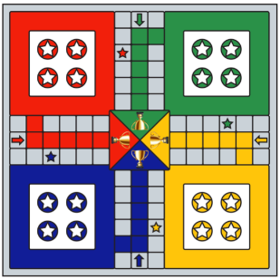

# Project Ludo: Solving ludo in a algorithmic fashion

## Abstract
Ludo is a board game that originated in India and is now a common game in almost all Indian households. The game is played with two or more players with its main objective being to transfer all your pawns (there are 4 per player) from the base to the center of the board (called home) before anyone else. In our project, we will analyze algorithmically the nature of the game and its tradeoffs. 

The game is played on a squared grid, having 72 boxes (52 of which are common to all players), 8 of the common ones being safe spots. The game starts with each player having 4 pawns in a corner of the board, and they must move them, according to the result of a dice roll from their respective base to the center of the board. The winner is the player who finishes this task the earliest.

We decided to analyze algorithmically the game Ludo, because it involves an array of strategic decisions and tradeoffs at every move of a pawn. Players must decide which pawn to move and how to threaten their opponents strategically. The players also have numerous trade offs while playing some of them being, keep on chasing an opponent’s pawn and save another pawn from being chased, take an instant kill when available or continue chasing an opponent’s pawn that’s about the get to the destination and many other interesting scenarios. In addition to that, there’s also a randomness element, represented by the dice roll, which adds another layer of uncertainty and complexity to the game.

### To learn more about the algorithms or about the game itself refer to our [project report](docs/CSE_202__Ludo_Project.pdf)

### The game currently works in cli only.

#### Note: the game has been simplified to an extent as mentioned in the "Game Simplification" section of the [report](docs/CSE_202__Ludo_Project.pdf) which include removing six reqd to exit base, and home stretch. 
##### P.S. The algorithms and the results & proofs shown should follow a similar fashion and trend if these simplifications were not made.
##### P.P.S. If you wanna further develop or modify existing algorithms, you might want to look at the commit named: "Added no home stretch, not six reqd, game ends when one wins" and also the commits just before and after this. It has a lot of good skeleton code to enable those features based on our original [project formulation](docs/AOA_202_Project_Formulation.pdf). Only algorithmic if-else condition changes would be needed to handle when a pawn move is invalid.

## Milestones achieved:
1. Random, Fast, Aggressive, Defensive, Mix
2. Main.py controls everything in one!

How to run:
1. Main.py is your friend to simulate!
    - There are two ways to run the game.
        *  Line 14: You may edit the config list and then run accordingly.
            - The list format is: # Config - [pawns per player, strategy1, strategy2, ...]
            - EG: [4, agressiveAlgo, agressiveAlgo, agressiveAlgo, mixAlgo]
        * You may pass a the config as an empty list [] and this will activate the cli to ask you about the config where you will manually add it.
2. To run human v human, directly run game.py

### The results are available in the [experimation report](docs/Ludo_Implementation.pdf) where we explored and verified our algorithmic proofs were right using emperical data
	 

#### Feel free to cite and use these algorithms if you wanna build upon the same!
